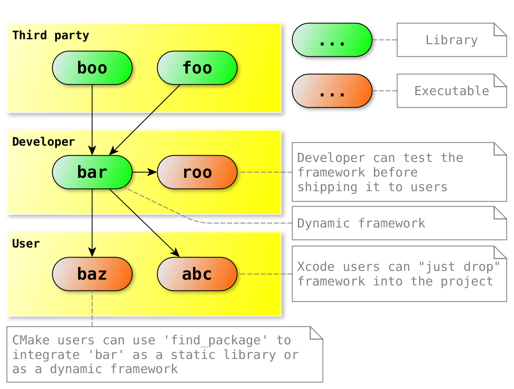
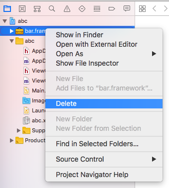
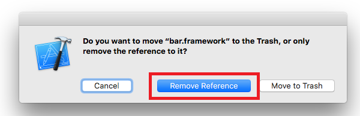
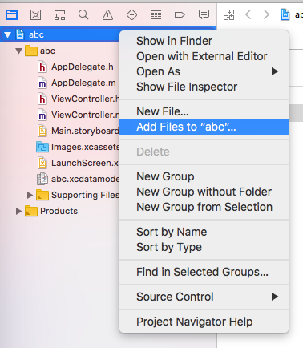
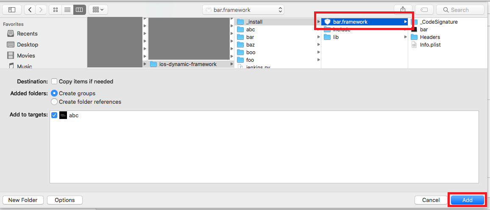
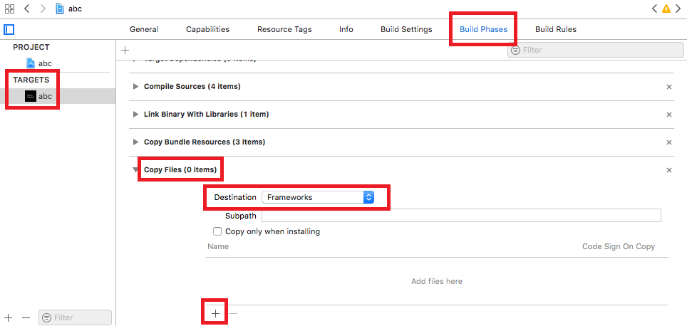
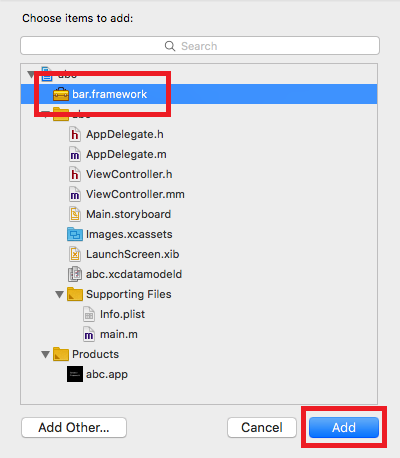
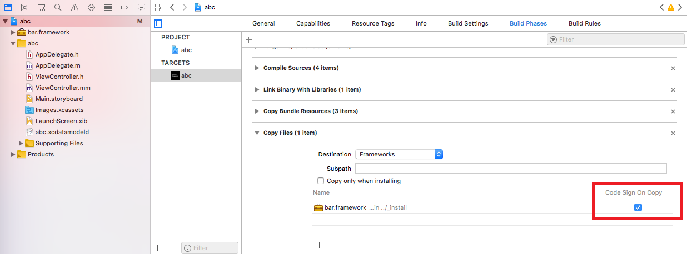
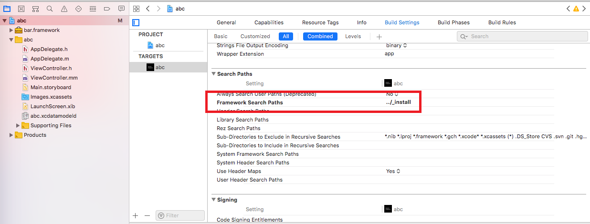

* Static libraries: ``foo``, ``boo``. Represent third party code.
* Dynamic framework ``bar``. Depends on ``foo`` and ``boo``. Represent developer's code.
* Application ``roo`` from project ``bar`` can be used to test ``bar`` framework from the same CMake project.
* Application ``baz`` load dynamic framework ``bar``. Represent CMake (Xcode generator) user's code.
* Native Xcode iOS project ``abc`` use ``bar.framework``. Represent native Xcode (no CMake) user's code.

Requirements
------------

* Dynamic frameworks available since iOS 8.0 (Xcode 6)
* CMake 3.5+ with `IOS_INSTALL_COMBINED <https://cmake.org/cmake/help/v3.5/release/3.5.html#platforms>`__ feature
* Python 3 for `polly.py script <https://github.com/ruslo/polly>`__

``polly.py`` script should be in PATH:

.. code-block:: none

  > git clone https://github.com/ruslo/polly
  > export PATH=`pwd`/polly/bin:$PATH
  > which polly.py

Build framework for ``arm64`` architecture:

.. code-block:: none

  > ./jenkins.py --toolchain ios-11-4-dep-9-3-arm64

  > ls _install/bar.framework
  ...

  > lipo -info _install/bar.framework/bar
  Non-fat file: _install/bar.framework/bar is architecture: arm64

Build universal 5 architectures framework:

.. code-block:: none

  > ./jenkins.py --toolchain ios-11-4-dep-9-3

  > ls _install/bar.framework
  ...

  > lipo -info _install/bar.framework/bar
  Architectures in the fat file: _install/bar.framework/bar are: i386 x86_64 armv7 armv7s arm64

Adding framework to Xcode project
---------------------------------

* Build dynamic framework ``bar.framework`` first (!) See previous section.
* Open ``abc`` Xcode project: ``File`` -> ``Open`` -> ``ios-dynamic-framework/abc/abc.xcodeproj``
* Run ``abc`` target on iOS device/simulator

If you want to test the adding of framework from scratch:

* Remove ``bar.framework`` link

* Choose ``Remove Reference`` because file should not be removed from disk

* Select project and choose ``Add Files to "abc"...``

* Pick ``bar.framework`` from ``_install`` directory

* Add a command to copy the framework: ``Build Phases`` -> ``New Copy Files Phase`` -> Set ``Destination`` to ``Frameworks`` -> ``+``

* Choose ``bar.framework`` and click ``Add``

* Verify that ``Code Sign On Copy`` is set

* Verify that ``Framework Search Paths`` is set to ``../_install`` (project relative location)

* Run ``abc``

Headers
-------

Project ``bar`` installs ``bar.hpp`` header to
``<install-prefix>/include/bar/bar.hpp``. So ``bar.hpp`` can be included by C++
directive ``#include <bar/bar.hpp>`` if used in a plain non-framework
configuration. For frameworks location will be ``bar.framework/Headers/bar.hpp``
and can be included by the same C++ directive ``#include <bar/bar.hpp>``.

Visibility
----------

Default
=======

Export all symbols (default):

.. code-block:: none

  > ./jenkins.py --toolchain ios-11-4-dep-9-3-arm64
  
  > nm -gU _install/bar.framework/bar
  ... T __Z3barv
  ... T __Z3boov # from static library boo
  ... T __Z3foov # from static library foo

File with exports
=================

Exported symbols can be listed explicitly in file using ``-exported_symbols_list`` option:

.. code-block:: none

  > cat bar/libbar.exports
  __Z3barv
  
  > ./jenkins.py --toolchain ios-11-4-dep-9-3-arm64 --export-file
  
  > nm -gU _install/bar.framework/bar
  ... T __Z3barv

Toolchain
=========

Explicit export (export only BAR_EXPORT, all other symbols are hidden):

.. code-block:: none
  
  > ./jenkins.py --toolchain ios-10-1-arm64-dep-8-0-hid-sections
  
  > nm -gU _install/bar.framework/bar
  ... T __Z3barv # only bar visible

.. note::

  Achieved by adding ``-fvisibility=hidded`` and ``-fvisibility-inlines-hidded`` to ``CMAKE_CXX_FLAGS`` in toolchain

``foo`` and ``boo`` exist but not visible:

.. code-block:: none

  > otool -vt _install/bar.framework/bar | grep "^__Z3\(foo\|boo\)"
  __Z3foov:
  __Z3boov:

App Store Submission
--------------------

Use toolchain with device architectures only (arm64, armv7, armv7s).
For example arm64 + armv7:

.. code-block:: none

  > ./jenkins.py --toolchain ios-11-4-dep-9-3-arm64-armv7
  > open abc/abc.xcodeproj

Build, archive and submit application.

More
----

* `Hunter package manager <https://github.com/ruslo/hunter>`__
* `Polly toolchains <https://github.com/ruslo/polly>`__
